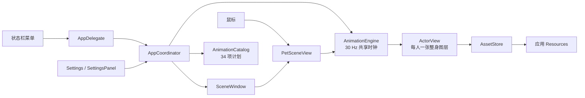

# 芙莉莲与辛美尔

**双人桌宠 · v0.1.0** · macOS 原生桌面伴侣 · GitHub 仓库：[`leonling12/XinFuPet`](https://github.com/leonling12/XinFuPet)

芙莉莲与辛美尔是在 macOS 桌面边缘活动的非官方同人桌宠。应用由 Swift 和 AppKit 构建：透明浮动窗口中展示两人的完整人物 PNG，以整张图切换动作关键帧；不拆分头、躯干、手臂或腿，也不对整个人物做交叉淡化。

## 功能一览

- 共 **34 项动作**：芙莉莲 F01–F13、辛美尔 H01–H13、双人互动 D01–D08。自动池包含全部 34 项；状态栏菜单也能逐项指定播放。
- 空闲时分别安排两人的单人动作和双人互动。随机间隔、避开最近动作、暂停、打断和结束规则见下文。
- 单击人物从对应单人动作池随机播放；双击任一人物随机播放双人互动；悬停可触发招呼/回望。右键菜单和状态栏提供动作与运行设置。
- 按住人物拖动可移动整组桌宠并驱动同步步态；拖动期间不会触发悬停动作。按透明 PNG 的可见像素命中，空白区域将鼠标事件透传给桌面。
- 状态栏可显示或隐藏桌宠、设置大小/间距/动作速度/自主活动频率/置顶/低动态，并暂停自主动作。隐藏只收起人物，应用和自动播放仍运行；可从状态栏显示，或在应用仍运行时再次打开“芙莉莲与辛美尔”。退出会结束应用，之后重新双击 App 启动。
- 递花使用一朵随手部移动的花道具。F13 伸展使用单独的 512×704 动作画布；默认动作画布为 512×576。

## 34 项动作：入口与关键帧顺序

记号：`neutral` 为站立原画；`legacy` 名称（如 `greet`、`read`）是完整人物原画；`family 0..3` 表示该动作族的整身关键帧；`→` 表示播放次序。**下表所有动作都在自动池中**；“状态栏”指从「桌宠 → 动作 → 芙莉莲 / 辛美尔 / 双人互动」逐项指定。单击池、双击池和右键快捷项在下文解释。

### 芙莉莲

| ID | 动作 | 自动 | 手动入口 | 关键帧顺序概要 |
|---|---|---|---|---|
| F01 | 翻阅魔法书 | 是 | 状态栏；芙莉莲单击池 | neutral → bookajar → bookhalf → read → bookhalf → bookajar → neutral |
| F02 | 查看地图 | 是 | 状态栏 | neutral → map 0..3 → neutral |
| F03 | 举杖施法 | 是 | 状态栏；芙莉莲单击池 | neutral → staffraise → staff → cast → staffraise → neutral |
| F04 | 研究路边小物 | 是 | 状态栏 | neutral → inspect 0..3 → neutral |
| F05 | 整理头发和衣领 | 是 | 状态栏；芙莉莲单击池 | neutral → adjust 0..3 → neutral |
| F06 | 整理行囊 | 是 | 状态栏 | neutral → pack 0..3 → neutral |
| F07 | 扶杖观察 | 是 | 状态栏 | neutral → staffraise → staff → staffraise → neutral |
| F08 | 坐下读书 | 是 | 状态栏 | neutral → sit 0→1→2（保持）→1→0 → neutral |
| F09 | 看书时打盹 | 是 | 状态栏 | 先坐下（已坐姿则省略）→ doze 0..3 → sit-2 保持 |
| F10 | 打盹后醒来 | 是 | 状态栏 | sit/doze 过渡 → doze 0..3 → sit 2→1→0 → neutral |
| F11 | 听见动静回望 | 是 | 状态栏；芙莉莲单击池；悬停 0.55 秒 | neutral → notice 0..3 → neutral |
| F12 | 缓步向前 | 是 | 状态栏 | neutral → walk 0..3（向右）→ neutral |
| F13 | 伸展肩背 | 是 | 状态栏 | neutral → stretch 0..3 → neutral |

### 辛美尔

| ID | 动作 | 自动 | 手动入口 | 关键帧顺序概要 |
|---|---|---|---|---|
| H01 | 向你招呼 | 是 | 状态栏；辛美尔单击池；悬停 0.25 秒 | neutral → greetquarter → greetstart → greet → greetstart → greetquarter → neutral |
| H02 | 坐下休息 | 是 | 状态栏 | neutral → sit 0→1→2→3（保持）→2→1→0 → neutral |
| H03 | 递上一朵花 | 是 | 状态栏；辛美尔单击池 | neutral → offer 0..7（出现一朵花）→ neutral（花隐藏） |
| H04 | 整理披风 | 是 | 状态栏 | neutral → cape 0..3 → neutral |
| H05 | 练习剑术 | 是 | 状态栏 | neutral → swordcheck 0→1 → practice 0..3→0 → neutral |
| H06 | 确认佩剑 | 是 | 状态栏 | neutral → swordcheck 0..3 → neutral |
| H07 | 摆出勇者姿势 | 是 | 状态栏；辛美尔单击池 | neutral → hero 0..3 → neutral |
| H08 | 回头等同伴 | 是 | 状态栏 | neutral → look 0..3 → neutral |
| H09 | 指向远处风景 | 是 | 状态栏 | neutral → point 0..3 → neutral |
| H10 | 弯腰拾起物件 | 是 | 状态栏 | neutral → kneel 0..3 → neutral |
| H11 | 安静等候 | 是 | 状态栏 | neutral → rest 0..3 → neutral |
| H12 | 缓步巡看 | 是 | 状态栏 | neutral → walk 0..3（向左）→ neutral |
| H13 | 翻看旅途笔记 | 是 | 状态栏 | neutral → read 0..3 → neutral |

### 双人互动

| ID | 动作 | 自动 | 手动入口 | 关键帧顺序概要 |
|---|---|---|---|---|
| D01 | 错拍对视 | 是 | 状态栏；双击池 | 辛美尔 look → 芙莉莲 notice（错开响应）→ 两人 neutral |
| D02 | 互相问候 | 是 | 状态栏；双击池；右键「打招呼」 | 辛美尔 greet；芙莉莲稍后 notice → 两人 neutral |
| D03 | 并肩看书 | 是 | 状态栏；双击池；右键「共同看书」 | 芙莉莲 bookajar→bookhalf→read；辛美尔转向下看书 → 两人 neutral |
| D04 | 一起散步 | 是 | 状态栏；双击池 | 同步 walk、辛美尔相位偏移 0.25、错开起步 → 两人 neutral |
| D05 | 看地图认路 | 是 | 状态栏；双击池 | 芙莉莲 map；辛美尔稍后 point → 两人 neutral |
| D06 | 递花并接过 | 是 | 状态栏；双击池；右键「递一朵花」 | 辛美尔 offer、芙莉莲 receive；同一朵花从一双手交到另一双手 → 辛美尔 neutral，芙莉莲保持 receive-7 持花 |
| D07 | 展示小魔法 | 是 | 状态栏；双击池；右键「小魔法」 | 芙莉莲 staffraise→staff→cast；辛美尔 rest → 两人 neutral |
| D08 | 一起坐下休息 | 是 | 状态栏；双击池；右键「坐下休息」 | 两人错开坐下、短暂停留，再起身回 neutral |

## 自动播放、手动操作与播放规则

### 自动播放

- 芙莉莲、辛美尔各有独立的单人计时器；每次随机等待 **25–60 秒 ÷ 自主活动频率**。两人各自从排除最近 3 个自动选择 ID 后的候选池等概率抽取。
- 双人互动另有独立计时器；每次随机等待 **120–240 秒 ÷ 自主活动频率**，从排除最近 4 个自动选择 ID 后的候选池等概率抽取。
- 自动抽取会分别排除最近 **3 个单人动作**或 **4 个双人动作**，再从剩余候选中等概率选择。该回避只影响自动抽取。
- 动作目录中的「低频」和 `cooldown` 秒数是元数据，当前调度没有执行这些冷却或低频权重；三类动作池中每项机会相同。这里没有固定的 34 项播放顺序。
- 任一动作正在播放时，计时器到期的自动事件会被丢弃，不排队，并为该类别重新随机安排等待。暂停会停止自动计时；恢复后重新安排。忙碌、暂停时都不会积累待播队列。

### 手动交互

- **单击芙莉莲**：从 F01、F03、F05、F11 中随机选一项。
- **单击辛美尔**：从 H01、H03、H07 中随机选一项。
- **双击任一人物**：从 D01–D08 中随机选一项；识别双击后会吞掉该次松开的单击，避免连播单人动作。
- **悬停**：鼠标停在芙莉莲身上 0.55 秒触发 F11；停在辛美尔身上 0.25 秒触发 H01。移出、按下或开始拖动会取消尚未触发的悬停动作。F05 虽在目录触发标签中标有「悬停」，实际悬停入口是 F11。
- **左键拖动**：按下时捕获命中的人物；移动超过 3 pt 后，整组窗口跟随光标，鼠标位移驱动两人同步步态。水平移动决定左右方向，垂直移动不会强制改向；向右拖时芙莉莲在前景，向左拖时辛美尔在前景。步频最多 0.5 phase/秒，约每秒最多 2 次腿态切换；无位移不推进，也不追赶停顿。松开后收步 0.20 秒再回 neutral。拖动期间取消并屏蔽悬停触发。
- **右键人物**：快捷动作 D02、D03、D06、D07、D08；暂停/恢复自主动作；设置大小；隐藏或退出。
- **状态栏「桌宠」菜单**：暂停/恢复、随机触发双人互动、逐项播放全部 34 个动作、打开连续滑杆设置、恢复默认设置；大小预设 70%、100%、145%、190%；动作速度预设 0.75×、1.0×、1.25×、1.5×；自主活动频率预设 0.5×、1.0×、1.5×、2.0×；自主走动、始终置顶、低动态开关；显示、隐藏、退出。
- **连续滑杆设置**：双人大小 55–200%、人物间距 0–140 pt、动作速度 0.5–2.0×、自主活动频率 0.35–2.0×。右键「设置大小…」也可输入百分数；输入接受 55–200%，并受屏幕可用范围限制。尺寸、间距、速度和频率保存在用户设置中。

### 暂停、打断与动作结束

- 暂停时取消自动计时并冻结当前动作时钟，画面停在当前关键帧；恢复后重新安排自动计时。暂停期间的点击动作不会开始播放。
- 新动作或手动拖动会取消正在播放的动作，**保留当时画面姿势并立即开始新的操作**；动作不会排队。被打断的动作不会继续走到其正常结束姿势；只包含另一人物的新动作也不会替前一动作补播收尾。
- 未被打断的普通动作结束时回到 neutral。两项特例：F09 结束并保持芙莉莲坐姿 sit-2；D06 结束时辛美尔回 neutral，芙莉莲保持 receive-7 并持花。H03 收回到辛美尔 neutral 并隐藏花。
- F12/H12 的整图走路动作无论「自主走动」开关如何都会播放；此开关只控制自动播放 F12/H12 后窗口是否轻移。手拖步态仍由拖动控制。
- 手拖走路每角色用 4 个索引循环两种腿部姿态（ABAB），不是 4 种独立步态图。停拖后先收至稳定步态帧，再回 neutral；若松手时处于暂停状态，恢复后再完成收步。
- 「低动态」影响窗口移动和缩放过渡，不会放慢动作关键帧；动作速度设置控制共享动作时钟。

## 程序结构



`AppDelegate` 注册 accessory app 与状态栏菜单；`AppCoordinator` 管生命周期、独立自动计时器、动作中断和窗口位置；`PetSceneView` 处理人物布局、命中测试、鼠标手势和花道具；`AnimationEngine` 以 30 Hz 时钟采样 `AnimationCatalog` 中的动作计划。每个人物仅有一个显示完整人物图的 `CALayer`，通过即时替换整张 PNG 显示姿势；`AssetStore` 从 app bundle 读取图片和固定锚点。动作共用同一时钟，双人动作可以设定错开响应；暂停时冻结动作进度。

| Swift 源文件 | 主要职责 |
|---|---|
| `Sources/XinFuPet/main.swift` | AppKit 程序入口。 |
| `Sources/XinFuPet/AppDelegate.swift` | accessory app、状态栏与 34 项动作菜单、设置入口。 |
| `Sources/XinFuPet/AppCoordinator.swift` | 窗口生命周期、自动调度、播放/取消、大小与位置。 |
| `Sources/XinFuPet/SceneWindow.swift` | 透明非激活面板、鼠标事件透传和捕获。 |
| `Sources/XinFuPet/PetSceneView.swift` | 人物布局、可见像素命中、单击/双击/悬停/拖动、花道具。 |
| `Sources/XinFuPet/AnimationCatalog.swift` | 34 项动作 ID、时长、参与者和关键帧轨道。 |
| `Sources/XinFuPet/AnimationEngine.swift` | 共享动作时钟、帧采样、暂停/完成/取消、递花交接。 |
| `Sources/XinFuPet/ActorView.swift` | 单张整身 PNG 图层、缩放与固定锚点布局。 |
| `Sources/XinFuPet/AssetStore.swift` | bundle 资源读取、缓存和锚点元数据。 |
| `Sources/XinFuPet/Settings.swift`, `SettingsPanel.swift` | 持久设置与连续滑杆窗口。 |
| `Sources/XinFuPet/Models.swift` | `ActorID`、关键帧、轨道和动作计划数据结构。 |

运行时清单共 **142 项**：35 张原始完整人物图、104 张 canonical 整身关键帧、2 份锚点元数据和 1 张花道具图。创作档案有 15 张来源图、13 份原始提示词；其中两张来源图没有单独保存的提示词，文档如实标为缺失。运行时画布默认 512×576；F13 stretch 单独使用 512×704。所有整身姿势按动作族固定脚底与躯干锚点注册，不逐帧按包围盒缩放。

发布构建和验证脚本位于 `scripts/`；运行时资源白名单与 SHA-256 记录位于 `verification/`。`AssetStore` 负责读取 bundle 中的资源，不负责校验发布白名单。

后续维护所需的完整 34 项计划元数据、每帧素材路径与哈希、源图/提示词档案、校验步骤和更细的播放实现说明，见[架构与素材交接](docs/ARCHITECTURE.zh-CN.md)。

## 后续计划

以下方向尚未接入 v0.1.0：

- [ ] 优化点击、拖动、菜单和大小设置等交互反馈。
- [ ] 优先研究 Codex 状态与桌宠联动，探索思考、执行、完成、等待输入等状态的动作/轻提示映射，以及桌宠输入和任务回传的可行方式；不预设尚未验证的外部接口。
- [ ] 优先研究微信新消息提醒，探索消息触发的动作或轻提示与可关闭选项。

## 系统要求

- 最低系统：macOS 13。
- v0.1.0 本机验证环境：macOS 15.7.4、Apple Silicon（arm64）。Intel Mac 尚未验证。
- 无第三方 Swift package 依赖；源码使用 Swift tools 5.10。
- 手拖走路使用四个相位索引循环呈现两种腿部姿态；「低动态」不减慢人物动作帧，「自主走动」不关闭手拖步态。

## 验证范围

已通过 34 项源时钟动作检查、35 张原画、142 项运行资源（包括 104 张 canonical 关键帧）以及签名/Bundle identity 构建校验；F13 最终伸展素材已通过源图审阅和运行时资源校验。**完整的原生 UI 逐项验收未完成**；本次发布不宣称 34 项动作均已由 Computer Use 逐项操作验收。

## 从源码构建

在 macOS 上安装包含 Swift 5.10 或更新版本的 Xcode Command Line Tools，然后在仓库根目录运行：

```sh
./scripts/build-releasebundle.sh
./scripts/verify-releasebundle.sh
```

构建脚本使用 `Resources/` 下的 SHA-256 白名单资源生成 `build/releasebundle/XinFuPet.app`。它不依赖本机交接目录、用户偏好或外部私有路径。

## 下载与首次打开

从 GitHub Releases 下载 `XinFuPet-v0.1.0-macos-arm64.zip`，解压后将 `芙莉莲与辛美尔.app` 移到“应用程序”文件夹并打开。

发布包使用 ad-hoc 签名，没有 Developer ID 签名或公证。如果 macOS 阻止首次打开，请前往“系统设置 → 隐私与安全性”，在安全性区域选择系统提供的“仍要打开 / Open Anyway”。不需要关闭 Gatekeeper 或移除隔离属性。

## 许可证与素材

项目源代码采用 [PolyForm Noncommercial 1.0.0](LICENSE)。这是**非商业源代码许可**，不属于 OSI 批准的开源许可证。它不授予芙莉莲、辛美尔、原作名称或任何原画的额外权利；相关角色和作品权利仍归各自权利人。详见 [NOTICE](NOTICE.md) 与 `art/` 中的来源记录。项目为非官方同人作品，与原作权利方无隶属或背书关系。
