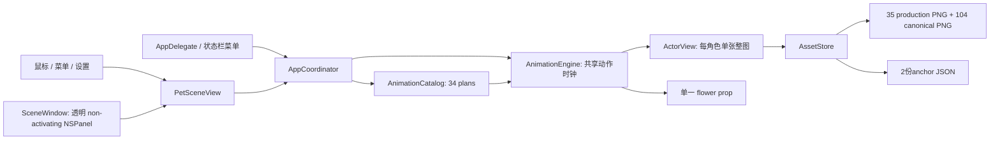

# 芙莉莲与辛美尔（XinFuPet）架构与素材交接

> **用途**：给后续维护者快速理解正式桌宠的模块边界、动作路由、素材清单和发布验证入口。发布版文档路径为 `docs/ARCHITECTURE.zh-CN.md`，并由README链接。
>
> **基线**：XinFuPet v0.1.0；代码只显示完整人物原画和整图关键帧。35 张原production PNG以 SHA-256 基线锁定，没有肢体拆片、IK、网格变形或逐帧包围盒缩放。
>
> **版本范围**：本文说明 v0.1.0 的程序结构、动作目录、素材清单、交互方式与源码维护入口。

## 1. 程序入口与数据流

`main.swift` 创建 AppKit application，`AppDelegate` 以 accessory app 注册状态栏菜单并启动 `AppCoordinator`。协调器创建透明 `SceneWindow`，启动每角色与双人事件计时器；场景把动作ID交给 `AnimationCatalog` 和 `AnimationEngine`，资源由 `AssetStore` 从应用bundle `Resources/` 读取。



| 源文件 | 职责 |
|---|---|
| `Sources/XinFuPet/main.swift` | AppKit启动入口。 |
| `Sources/XinFuPet/AppDelegate.swift` | accessory app、状态栏菜单、动作列表、暂停/速度/频率/低动态等入口。 |
| `Sources/XinFuPet/AppCoordinator.swift` | 场景生命周期、三组自动计时器、计划播放/取消、窗口位置/层级、拖动协调。 |
| `Sources/XinFuPet/SceneWindow.swift` | borderless透明面板和global/local事件监视器；鼠标落在透明空白区时把事件透传给桌面。 |
| `Sources/XinFuPet/PetSceneView.swift` | F/H两只角色布局、花道具、鼠标命中/输入、拖动走路phase和前后层级。 |
| `Sources/XinFuPet/ActorView.swift` | 一个角色只含一张完整全身PNG的 `CALayer`；整图即时替换，维护 alpha mask 和anchor布局。 |
| `Sources/XinFuPet/AssetStore.swift` | 资源根目录解析、图片缓存、加载production白名单、anchor元数据与逐帧文件。 |
| `Sources/XinFuPet/AnimationCatalog.swift` | 34个 `ActionPlan` 的ID、中文名、持续时间、目录标签、tracks/keyframe和冷却标记。 |
| `Sources/XinFuPet/AnimationEngine.swift` | 30Hz共享时钟、动作采样、canonical序列、暂停/完成/取消、花朵交接。 |
| `Sources/XinFuPet/Models.swift` | `ActorID`、`PoseKeyframe`、`ActorTrack`、`ActionPlan` 数据结构。 |
| `Sources/XinFuPet/Settings.swift`, `SettingsPanel.swift` | `UserDefaults`持久设置和连续滑杆设置窗。 |

## 2. AppKit窗口、绘制与命中

- 窗口是 borderless、non-activating `NSPanel`；`isOpaque = false`、背景clear、无投影，参与全部Space并可在全屏辅助显示。面板默认置顶，设置可切换普通层级。
- `PetSceneView` 下包含两个 `ActorView` 和一个 `flowerView`。每个角色仅有一个 `fullBody` 图片layer；动画通过替换 `contents` 显示另一张完整人物图，不淡化、不重影。原人物完整图不在运行时被切成头、躯干、手臂或腿。
- 命中测试按当前PNG的alpha mask计算，透明阈值为 `alpha > 0.08`；canonical帧用固定image rect映射回PNG像素。透明区域不拦截桌面输入；两人重叠时按当前walk方向的前景角色顺序做命中。每个可点角色以标准Button暴露辅助功能名称、动态命中区域以及Press/ShowMenu行为。
- 最终交互移除可见角标和鼠标resize分支；body drag与trackpad magnify仍保留。右键“设置大小…”打开标题为“设置桌宠大小”的标准NSAlert，先激活accessory app，再聚焦并选中标为“桌宠大小百分比”的输入框；Enter/“应用”提交并持久化，Esc/“取消”保留原值。拒绝空值、NaN和非有限数；有效值限55–200%，再按当前屏幕最大尺寸夹限。完整原生UI输入验收尚未完成。

## 3. 动作目录（34项）

表中“目录触发标签”和“标注冷却”是 `AnimationCatalog` 的计划元数据；真正的自动/鼠标入口见第4节。当前协调器未执行每条计划的 `cooldown` 数字，而用最近ID集合回避重复。

| ID | 名称 | 参与者 | 目录触发标签 | 时长 | 标注冷却* | 原pose / canonical family | 终态 |
|---|---|---|---|---:|---:|---|---|
| `D01` | 错拍对视 | F + H | 自主 / 双击 | 5.2s | 90s | Himmel canonical look + Frieren canonical notice | 两人回 neutral |
| `D02` | 互相问候 | F + H | 双击 / 点击菜单 | 5.0s | 70s | Himmel legacy greet + Frieren canonical notice | 两人回 neutral |
| `D03` | 并肩看书 | F + H | 自主 / 菜单 | 8.0s | 125s | Frieren legacy bookajar/bookhalf/read；Himmel canonical down-look frame look-3 | 两人回 neutral |
| `D04` | 一起散步 | F + H | 自主 / 菜单 | 7.0s | 140s | 两人 canonical walk 0–3 | 两人回 neutral |
| `D05` | 看地图认路 | F + H | 自主低频 | 6.5s | 130s | Frieren canonical map + Himmel canonical point | 两人回 neutral |
| `D06` | 递花并接过 | F + H | 自主 / 菜单 | 7.0s | 160s | Himmel canonical offer + Frieren canonical receive + 单一 flower prop | H 回 neutral；Frieren 保持 receive-7 并持花 |
| `D07` | 展示小魔法 | F + H | 双击 / 菜单 | 6.4s | 145s | Frieren legacy staffraise/staff/cast + Himmel canonical rest | 两人回 neutral |
| `D08` | 一起坐下休息 | F + H | 自主低频 | 9.0s | 170s | Frieren/Himmel canonical sit | 两人回 neutral |
| `F01` | 翻阅魔法书 | F | 自主 / 单击 | 6.0s | 35s | legacy full-body: bookajar → bookhalf → read | 完成后回 neutral |
| `F02` | 查看地图 | F | 自主 | 5.5s | 55s | canonical map 0–3 | 回 neutral |
| `F03` | 举杖施法 | F | 单击 / 双人互动 | 5.0s | 55s | legacy: staffraise → staff → cast | 回 neutral |
| `F04` | 研究路边小物 | F | 自主 | 5.0s | 40s | canonical inspect 0–3 | 回 neutral |
| `F05` | 整理头发和衣领 | F | 自主 / 悬停 | 4.6s | 36s | canonical adjust 0–3 | 回 neutral |
| `F06` | 整理行囊 | F | 自主 | 5.5s | 50s | canonical pack 0–3 | 回 neutral |
| `F07` | 扶杖观察 | F | 自主低频 | 4.8s | 55s | legacy staffraise / staff | 回 neutral |
| `F08` | 坐下读书 | F | 自主 / 菜单 | 8.5s | 70s | canonical sit 0–3 | 回 neutral |
| `F09` | 看书时打盹 | F | 自主低频 | 9.0s | 100s | canonical sit + doze 0–3 | 结束保持坐姿 sit-2 |
| `F10` | 打盹后醒来 | F | 自主低频 | 5.0s | 60s | canonical sit + doze sequence | 回 neutral |
| `F11` | 听见动静回望 | F | 悬停 / 点击 | 4.5s | 30s | canonical notice 0–3 | 回 neutral |
| `F12` | 缓步向前 | F | 自主走动 | 6.2s | 50s | canonical walk 0–3 | 回 neutral |
| `F13` | 伸展肩背 | F | 自主 | 4.8s | 65s | canonical stretch 0–3 | 回 neutral |
| `H01` | 向你招呼 | H | 单击 / 悬停 | 4.0s | 30s | legacy greetquarter → greetstart → greet | 回 neutral |
| `H02` | 坐下休息 | H | 自主 / 菜单 | 8.0s | 75s | canonical sit 0–3 | 回 neutral |
| `H03` | 递上一朵花 | H | 双人互动 | 6.5s | 120s | canonical offer 0–7 + 一朵 flower prop | H 回 neutral，花隐藏 |
| `H04` | 整理披风 | H | 自主 | 4.8s | 38s | canonical cape 0–3 | 回 neutral |
| `H05` | 练习剑术 | H | 自主低频 / 菜单 | 5.7s | 90s | canonical swordcheck 0–3 + practice 0–3 | 回 neutral |
| `H06` | 确认佩剑 | H | 自主 | 4.4s | 55s | canonical swordcheck 0–3 | 回 neutral |
| `H07` | 摆出勇者姿势 | H | 自主 / 单击 | 4.4s | 50s | canonical hero 0–3 | 回 neutral |
| `H08` | 回头等同伴 | H | 自主 | 4.8s | 45s | canonical look 0–3 | 回 neutral |
| `H09` | 指向远处风景 | H | 双人互动 | 4.8s | 55s | canonical point 0–3（含画内回收姿势） | 回 neutral |
| `H10` | 弯腰拾起物件 | H | 自主 | 5.0s | 60s | canonical kneel 0–3 | 回 neutral |
| `H11` | 安静等候 | H | 自主低频 | 4.5s | 55s | canonical rest 0–3 | 回 neutral |
| `H12` | 缓步巡看 | H | 自主走动 | 6.0s | 55s | canonical walk 0–3 | 回 neutral |
| `H13` | 翻看旅途笔记 | H | 自主 | 5.8s | 70s | canonical read 0–3 | 回 neutral |


\* `cooldown` 当前仅保存在 `ActionPlan`，无调度读取点；不能当成真实冷却保证。除了D06交花和F09坐下打盹后的坐姿保持，其余完成路径回到neutral。计划播放不排队：新的单击、双击、菜单动作或走路拖动会取消当前clock并按当下已显示姿势继续/替换。

### 可移植anchor例子与帧替换步骤

`Resources/Motion/CanonicalKeyframesV1/action-anchors.json`只记录资源内相对文件名、固定注册参数、动作帧列表、gesture pinch点和逐帧SHA，不应含生成sheet绝对地址：

```json
{
  "version": 1,
  "canvas": { "width": 512, "height": 576 },
  "actors": {
    "himmel": {
      "sit": {
        "files": ["sit-0.png", "sit-1.png", "sit-2.png", "sit-3.png"],
        "nativeCanonicalBodyHeight": 490.0,
        "torsoRootX": 252.0,
        "footAnchorY": 544.0
      }
    }
  },
  "frameSHA256": {
    "Motion/CanonicalKeyframesV1/frames/himmel/look-3.png": "<sha256>"
  }
}
```

全局动作画布默认为512×576；动作定义可覆写画布。F13 `stretch` 使用512×704画布，四帧共用0.60049缩放，主体高度490px、foot Y=672、torso root X=266。单帧替换示例：覆盖 `Resources/Motion/CanonicalKeyframesV1/frames/himmel/look-3.png` 后，必须同步更新 `action-anchors.json` 的 `frameSHA256` 键、`verification/runtime-resource-allowlist.json` 对应 `canonicalFrames` 项SHA，以及source archive里的所用slot/源sheet SHA/prompt provenance。帧数、root或foot发生变化时再同步`actors.himmel.look`中的`files`/anchors。保留总142文件时路径数量不变；随后运行 `./scripts/verify-releasebundle.sh`，检查图片和清单是否一致。

### canonical family映射概要

- Himmel：`sit`, `kneel`, `offer`, `cape`, `swordcheck`, `practice`, `hero`, `read`, `rest`, `look`, `point`。
- Frieren：`sit`, `stretch`, `receive`, `map`, `inspect`, `adjust`, `pack`, `notice`, `doze`。F10由engine canonical分支执行sit/doze序列并回neutral；catalog track中的`wake` pose标签不实际读取`production_wake.png`。
- D03使用Himmel专用向左下看书的 `look-3.png`；该帧来自单独批准的downlook候选，不再把 `rest-1.png` 复用作look-3。`action-anchors.json`的frame hash是发布依据。该帧PNG SHA-256：`388544c1aff2be02c6f9461413072f20677c0257d2d8f71598046729da2c021d`。
- H03和D06复用同一个 `Motion/Props/flower.png`。D06在0.30–0.43按Himmel frame 3/4的抓握点定位；0.43–0.60只在Himmel frame 4与Frieren frame 4的双手抓握点中点交接；0.60之后跟随Frieren当前receive-hand，最终持于receive-7。花在交接全程贴手/手间，不自由漂浮，也没有第二朵。

## 4. 自动调度、鼠标与设置

### 自动动作

| 项目 | 规则 |
|---|---|
| 单人等待 | Frieren、Himmel各有独立一次性timer；每轮随机 `25–60秒 ÷ activityFrequency`。到时若动作忙或暂停则丢弃本轮，再随机排下一轮。 |
| 双人等待 | 独立timer随机 `120–240秒 ÷ activityFrequency`；同样受 `busy`/暂停挡住，错过即重排。 |
| 抽取池 | F01–F13、H01–H13、D01–D08；单人每角色回避最近3个ID，双人回避最近4个ID，再均匀随机。 |
| 概率理解 | 不是固定百分比开关。按平均timer速率估算，空闲情况下个人机会约89%、双人约11%；长动作与timer撞期会丢弃事件，所以实际比例会变化。 |
| 目录cooldown | 每个plan所带秒数目前未执行。目录写“自主低频”的F07/F09/F10、H05/H11、D05/D08仍从相同角色/双人池抽取，没有额外低频权重。 |
| 自主走动设置 | 关闭时只抑制F12/H12完成后的窗口水平nudge；F12/H12的走路整图动画仍会播放。 |

### 鼠标和菜单

| 输入 | 当前/目标行为 |
|---|---|
| 单击Frieren | 均匀抽F01、F03、F05、F11。 |
| 单击Himmel | 均匀抽H01、H03、H07。 |
| 双击任一角色 | 在mouseDown识别双击并从D01–D08均匀抽一个，随后吞掉mouseUp单击。 |
| 悬停 | 鼠标停在Frieren 0.55s触发F11；停在Himmel 0.25s触发H01；移出会取消尚未执行的任务。 |
| 左键拖动 | 按下时捕获实际命中的角色，直到松开才释放；超过3pt后面板跟随鼠标，同一鼠标位移驱动两角色同步步态。拖动期间取消并忽略悬停动作，避免悬停帧抢占步态。松开后进入短收步并回neutral；暂停期间松开则resume后收步。 |
| 右键角色 | 动作菜单：D02打招呼、D03共同看书、D06递花、D07小魔法、D08坐下休息；另有暂停/恢复、隐藏桌宠和退出桌宠。右键“设置大小…”按百分数输入；Enter应用并持久化，Esc/Cancel保留原值。 |
| 状态栏 | 显示桌宠、隐藏桌宠和退出桌宠是独立入口；另有暂停/恢复、随机双人动作、F/H/D全动作列表、尺寸/动作速度/活动频率、自动走动、置顶和低动态。 |

应用保持运行时可从状态栏“显示桌宠”重新显示窗口；再次打开应用也会恢复显示。

### 设置缺省值与影响

| 设置 | 默认值/范围 | 影响 |
|---|---|---|
| 双人大小 | 100%；输入接受55–200%，再受屏幕空间上限限制 | 场景缩放；canonical身体等比缩放。右键输入预选当前百分比；无效/非有限输入不应用。 |
| 人物间距 | 12pt；范围0–140pt | 场景中两人物之间的距离。 |
| 动作速度 | 1.0×；范围0.5–2.0× | 共享动作clock的累计速度；不改变PNG本身。 |
| 活动频率 | 1.0×；范围0.35–2.0× | 后续随机timer的等待时长；正在等待的timer不会即时重排。 |
| 自主走动 | 开 | 当前只控制F12/H12结束后的窗口nudge。 |
| 始终置顶 | 开 | floating或normal窗口层级。 |
| 低动态 | 关 | 当前影响窗口resize/nudge过渡，不减动作clock或关键帧切换速度。 |
| 暂停 | 关 | 取消所有自动timer并冻结动作elapsed；恢复后重排自动timer。设置经UserDefaults持久化；尺寸/间距/速度/频率默认值见`Settings.swift`。 |

### 手拖走路和步态

- 拖动移动整个透明桌宠窗口；走路距离按鼠标位移的二维欧氏距离累计，水平位移决定左右方向。垂直拖动不会强行改方向。
- 两人共享direction和phase，Himmel有0.25 phase offset以错开摆腿；走路朝右Frieren置前，朝左Himmel置前。点击命中按同一层级规则。
- walk anchor按每个角色/方向记固定root X、原生高度和脚锚。4个PNG索引驱动phase，但画面实质只有两种腿部姿态ABAB交替；不要把4索引宣传为4个独立步态姿势。
- **手拖方向与phase参数**：水平位移大于0.001pt时朝右，小于−0.001pt时朝左，垂直位移不强制改向；有效位移阈值为二维距离 `> 0.001pt`。stride为 `132pt × sizeScale`；每个实际鼠标事件的 `phase_delta = clamp(distance / stride, 0.22 × dt, 0.50 × dt)`，`dt ≤ 0.10s`。无位移时不推进，也不在鼠标停住后追赶。最快约0.5 phase/s，即4索引循环时每秒最多约2次腿态切换。停拖后依engine规则将偶数walk样本收至下一奇数样本，稳定0.20s再回neutral。

## 5. 共享动作clock、整图注册和花朵交接

### clock状态

1. `AppCoordinator.play`解析动作plan、置`busy`，调用`AnimationEngine.play`。
2. Engine取消旧generation，保留此刻人物姿势，记录参与角色与起始姿势，创建单个主队列30Hz `DispatchSourceTimer`。
3. 每tick按`delta × motionSpeed`累计elapsed（单tick delta上限0.1s）；暂停时clock仍可tick但elapsed不增加。
4. 每条track按startDelay/plan duration选原始pose或canonical全身PNG。D06两条轨共用同一progress，花按两手anchor在一条连续接触路径上更新。
5. 所有tracks结束后取消clock、清active ID、清步行层级并执行completion；协调器回收`busy`。手拖开始使旧generation失效但不重置当下人物姿势，手拖收步独立用engine计时。

### 关键帧锚与alpha

- legacy production poses来自原35张完整透明PNG；路径受 `AssetStore.productionImage` 白名单约束。它们在 `verification/style-baseline.json` 中的原始像素/哈希不可改。
- `action-anchors.json`按动作族记录文件名、画布尺寸、原生人物高度、躯干基点、脚底锚、帧hash和接触手锚点。每个动作族使用固定的躯干基点和脚底锚，避免关键帧在播放中跳动。
- 每帧用统一人物缩放和动作族固定root/foot落位；坐下/跪下时头部下降、腿弯曲；脚底对齐固定foot基准。没有逐帧检测bbox后强行fit，没有头腿拆图，没有形变。
- canonical walk PNG使用独立的 `walk-anchors.json`，按角色和方向记录原生人物高度、躯干基点与脚底锚。全帧共享统一缩放，只按方向调整躯干基点和脚底位置。
- 来源图以4×2网格组织；每张透明关键帧依据对应动作族的锚点定位，并保留统一的角色比例和脚底基准。逐帧PNG与来源记录见 `art/` 和 `verification/runtime-resource-allowlist.json`。
- 运行时只需要仓库内列出的完整人物PNG、canonical关键帧、锚点JSON和花朵资源。创作来源图与提示词保存在 `art/`，不打进应用包。

## 6. 142项Runtime资源清单

完整路径、hash和逐文件状态以 `verification/runtime-resource-allowlist.json` 为准。本节按组列出全部资源名；app bundle只应有35+104+2+1=142项，不包含来源sheet/提示词、QA或实验PNG。

### 原始production PNG（35）

**Frieren（18）**

- `Characters/Frieren/production_adjust.png`
- `Characters/Frieren/production_bookajar.png`
- `Characters/Frieren/production_bookhalf.png`
- `Characters/Frieren/production_cast.png`
- `Characters/Frieren/production_doze.png`
- `Characters/Frieren/production_inspect.png`
- `Characters/Frieren/production_map.png`
- `Characters/Frieren/production_neutral.png`
- `Characters/Frieren/production_notice.png`
- `Characters/Frieren/production_pack.png`
- `Characters/Frieren/production_read.png`
- `Characters/Frieren/production_sitread.png`
- `Characters/Frieren/production_sitstart.png`
- `Characters/Frieren/production_staff.png`
- `Characters/Frieren/production_staffraise.png`
- `Characters/Frieren/production_stretch.png`
- `Characters/Frieren/production_wake.png`
- `Characters/Frieren/production_walk.png`

**Himmel（17）**

- `Characters/Himmel/production_cape.png`
- `Characters/Himmel/production_flower.png`
- `Characters/Himmel/production_greet.png`
- `Characters/Himmel/production_greetquarter.png`
- `Characters/Himmel/production_greetstart.png`
- `Characters/Himmel/production_hero.png`
- `Characters/Himmel/production_kneel.png`
- `Characters/Himmel/production_look.png`
- `Characters/Himmel/production_neutral.png`
- `Characters/Himmel/production_point.png`
- `Characters/Himmel/production_read.png`
- `Characters/Himmel/production_rest.png`
- `Characters/Himmel/production_sit.png`
- `Characters/Himmel/production_sitstart.png`
- `Characters/Himmel/production_swordcheck.png`
- `Characters/Himmel/production_swordpractice.png`
- `Characters/Himmel/production_walk.png`

### Canonical动作帧（88）

**himmel（48）；目录 `Motion/CanonicalKeyframesV1/frames/himmel/`**

| action | 文件 |
|---|---|
| `cape` | `cape-0.png`, `cape-1.png`, `cape-2.png`, `cape-3.png` |
| `hero` | `hero-0.png`, `hero-1.png`, `hero-2.png`, `hero-3.png` |
| `kneel` | `kneel-0.png`, `kneel-1.png`, `kneel-2.png`, `kneel-3.png` |
| `look` | `look-0.png`, `look-1.png`, `look-2.png`, `look-3.png` |
| `offer` | `offer-0.png`, `offer-1.png`, `offer-2.png`, `offer-3.png`, `offer-4.png`, `offer-5.png`, `offer-6.png`, `offer-7.png` |
| `point` | `point-0.png`, `point-1.png`, `point-2.png`, `point-3.png` |
| `practice` | `practice-0.png`, `practice-1.png`, `practice-2.png`, `practice-3.png` |
| `read` | `read-0.png`, `read-1.png`, `read-2.png`, `read-3.png` |
| `rest` | `rest-0.png`, `rest-1.png`, `rest-2.png`, `rest-3.png` |
| `sit` | `sit-0.png`, `sit-1.png`, `sit-2.png`, `sit-3.png` |
| `swordcheck` | `swordcheck-0.png`, `swordcheck-1.png`, `swordcheck-2.png`, `swordcheck-3.png` |

**frieren（40）；目录 `Motion/CanonicalKeyframesV1/frames/frieren/`**

| action | 文件 |
|---|---|
| `adjust` | `adjust-0.png`, `adjust-1.png`, `adjust-2.png`, `adjust-3.png` |
| `doze` | `doze-0.png`, `doze-1.png`, `doze-2.png`, `doze-3.png` |
| `inspect` | `inspect-0.png`, `inspect-1.png`, `inspect-2.png`, `inspect-3.png` |
| `map` | `map-0.png`, `map-1.png`, `map-2.png`, `map-3.png` |
| `notice` | `notice-0.png`, `notice-1.png`, `notice-2.png`, `notice-3.png` |
| `pack` | `pack-0.png`, `pack-1.png`, `pack-2.png`, `pack-3.png` |
| `receive` | `receive-0.png`, `receive-1.png`, `receive-2.png`, `receive-3.png`, `receive-4.png`, `receive-5.png`, `receive-6.png`, `receive-7.png` |
| `sit` | `sit-0.png`, `sit-1.png`, `sit-2.png`, `sit-3.png` |
| `stretch` | `stretch-0.png`, `stretch-1.png`, `stretch-2.png`, `stretch-3.png` |

### Canonical walk帧（16）

| actor / 目录 | 文件 |
|---|---|
| `himmel` / `Motion/CanonicalKeyframesV1/frames/himmel/` | `left-0.png`, `left-1.png`, `left-2.png`, `left-3.png`, `right-0.png`, `right-1.png`, `right-2.png`, `right-3.png` |
| `frieren` / `Motion/CanonicalKeyframesV1/frames/frieren/` | `left-0.png`, `left-1.png`, `left-2.png`, `left-3.png`, `right-0.png`, `right-1.png`, `right-2.png`, `right-3.png` |

### 元数据与道具（3）

- `Motion/CanonicalKeyframesV1/action-anchors.json`
- `Motion/CanonicalKeyframesV1/walk-anchors.json`
- `Motion/Props/flower.png`

无额外icon资源；release Info.plist没有自定义app图标声明，active Swift无其他图片资源引用。


## 7. 正式原画与提示词来源档案

本节列出用于正式关键帧创作的源图及提示词。文件按仓库相对路径保存，SHA-256用于验证素材未被意外改动；这些源图不属于应用包的运行时资源。档案共15张源图、13份原始提示词；两张源图没有单独保存的提示词，表中标为缺失。

| 家族 | 来源图 | SHA-256 | 对应动作或使用说明 | 提示词 |
|---|---|---|---|---|
| F walk | `art/source-sheets/frieren-walk-directions-source-v2.png` | `2de9a78a378841ebf054181730ddbc0fe40883537ac6979ad3b783ffc42bc73f` | left/right walk各4帧 | `art/prompts/frieren-walk-directions-source-v2.prompt.txt` `0682bb0e919ca7c5a698bc8d7e7f9676da665199cb10aeb987aa510ea02ccf0a` |
| H walk | `art/source-sheets/himmel-walk-directions-source.png` | `f4abe0558d6c2a2adb24a553a329e894ac6d855d9d0fb69a0a59093b7a21da58` | left/right walk各4帧 | `art/prompts/himmel-walk-directions-source.prompt.txt` `242f8f0db78ad60c847b31fca31474d41a590b0eddf68ff6071fe2444b090237` |
| H offer | `art/source-sheets/himmel-offer-source.png` | `e77acb9e3ab2a2b7b41e11004987587beafc55b87a927ea744d7c684925f6cc9` | offer-0..7 | `art/prompts/himmel-offer-source.prompt.txt` `d67c8164fd212ffa6cd487e10f0d3accac084e95dae4cfe51ccdc89706f5862d` |
| F receive | `art/source-sheets/frieren-receive-source.png` | `a4e00ae60e564a631cf26a15cf4bf89052ba84ab608508775ca0c5b8184a5f2c` | receive-0..7 | `art/prompts/frieren-receive-source.prompt.txt` `e832999e87865045d2c2170878853b4ef820c2a02cd391006a905e9b569b414e` |
| F sit | `art/source-sheets/frieren-sit-stretch-transitions-source.png` | `e5a59672a117a333d79ff69f907b02985cfbac5fc7331bbc2701fae6348e503e` | 仅使用 sit-0..3；本图中的 stretch 格未进入最终帧 | `art/prompts/frieren-sit-stretch-transitions-source.prompt.txt` `79be79bf83d0d58a6b4c110972b676d05bcadd30877c8e1be98a7bb44c991cab` |
| F stretch v2 | `art/source-sheets/frieren-stretch-source-v2.png` | `59c3bbd81df39dc2873c978b312c62cea46196febdc5bda882153e57df89c934` | F13使用横向4格0..3；统一缩放0.60049；画布512×704、主体490 px、脚底Y=672、躯干根部X=266；逐帧裁切/去邻格碎片细节见 `art/provenance/frieren-stretch-v2-metadata.json` | `art/prompts/frieren-stretch-source-v2.prompt.txt` `f60bec3c8f3af84cc6a0fd2efba39bd9fe2ee72f45891fa722bd2675e3218e56` |
| H sit/kneel v2 | `art/source-sheets/himmel-sit-kneel-transitions-source-v2.png` | `1dc344e4ad8e02b0c7ccffa81132386c6cde000b6e38f320c3078737775e2d1e` | sit-0..3 + kneel-0..3 | `art/prompts/himmel-sit-kneel-transitions-source-v2.prompt.txt` `2479bebc9968e4d3678292cabd80a85ff7a3be36d47682df6212c20dd1392926` |
| F map/inspect v2 | `art/source-sheets/frieren-map-inspect-transitions-source-v2.png` | `a588da91d044ae932bb5ab6c633d8901d0c22ef80cc4c6ccb5dee8478f2bcfbe` | map-0..3 + inspect-0..3 | `art/prompts/frieren-map-inspect-transitions-source-v2.prompt.txt` `b9167512f6f35ee6d48f6ed76d263fa3a7b487ceb557449f19ecb1c411ca61da` |
| F adjust/pack v2 | `art/source-sheets/frieren-adjust-pack-transitions-source-v2.png` | `bd48f96a4882fd140a945cd8ff070ac5733dfd7ca4778487c2fb4e127df2194f` | adjust-0..3 + pack-0..3 | `art/prompts/frieren-adjust-pack-transitions-source-v2.prompt.txt` `19dd070328beadc41885b5a1aa11ff90336f807b5d600c7bae9f5bdc3fda4fc0` |
| F notice/doze | `art/source-sheets/frieren-notice-doze-transitions-source.png` | `e9322921c075d681f0b2203063095c3113593ad211b756c0b1132a3b4a9583bc` | notice-0..3 + doze-0..3 | `art/prompts/frieren-notice-doze-transitions-source.prompt.txt` `1b91a76ecc54dcefda810fbbe360767a7061807f17731010cd58d4eeb29aa26c` |
| H cape/swordcheck v2 | `art/source-sheets/himmel-cape-swordcheck-transitions-source-v2.png` | `96b35868fe595e0ffc60b576507480bf23e30a2d09f1097f2f930c4842f63bd9` | cape-0..3 + swordcheck-0..3 | 无（当前目录未找到对应独立prompt） | — |
| H practice/hero | `art/source-sheets/himmel-swordpractice-hero-transitions-source.png` | `a1bf975496f99485099f7fdd3c9feddf8032cb367f3a6d35592e734735df2ab7` | practice-0..3 + hero-0..3 | `art/prompts/himmel-swordpractice-hero-transitions-source.prompt.txt` `c1a852ee097ebd41bd8fed188e64384099f9cb2e53f1bd07b9676708fc38f94e` |
| H look/point v3 | `art/source-sheets/himmel-look-point-transitions-source-v3.png` | `e9b35ebcc48d77bd527248b6ebc08b46d9e8eecd69a981a0d98ce37b5d75e1c3` | look-0/1/2来自上排零基第0、1、2列；上排第3列未用；下排四格用于point-0..3 | 无 | — |
| H read/rest | `art/source-sheets/himmel-read-rest-transitions-source.png` | `d4988d584c8ec8ddc5059612968e82f4e564ace9980d4f27f1ae1b62083867ff` | read-0..3 + rest-0..3；rest-1仍是rest动作帧 | `art/prompts/himmel-read-rest-transitions-source.prompt.txt` `a6fbf20791defcf8cd39a8d7a13114bbddbc967443d42c861e5f8cdec71cfe73` |
| H D03专用downlook edit | `art/source-sheets/himmel-read-rest-transitions-source-downlook-candidate.png` | `99c67a0567010af7cd8559fd1e298a6a4c6ce98459484fb780afec45211ce6e4` | 只取底行零基第1列（第二格）为 look-3；其他7格不用 | `art/prompts/himmel-rest1-booklook-edit-prompt.md` `0fd061239ab1b0999f1d0e9540b40c8c6d879860983c9362d8edc200c2f7cb0c` |


Himmel look-3使用 downlook edit 底行零基第1列的单格；同图其他格不进入运行时动画。Himmel look/point v3上排零基第0、1、2列用于look-0/1/2，上排第3列未用；下排四格用于point-0..3。104张运行时关键帧以资源清单和帧hash为准。

## 8. 构建、校验与发行

### 本版验证范围

34项源时钟动作检查、35张原画基线、142项运行资源（含104张canonical关键帧）、F13最终高画布素材以及ad-hoc签名/Bundle identity检查已通过。完整的原生UI逐项验收没有完成；源时钟检查不等同于CU逐项触发菜单动作、拖动和设置的实机验收。

### 本地构建与release bundle

从source repo根目录运行：

```sh
./scripts/build-releasebundle.sh
./scripts/verify-releasebundle.sh
```

- SwiftPM工具版本5.10，platform minimum macOS 13。正式产物为 `build/releasebundle/XinFuPet.app`，`Info.plist`为0.1.0、`local.xi.xinfupet`、LSUIElement。
- build脚本按 `verification/runtime-resource-allowlist.json` 复制严格142个文件，而不是整个Resources目录；清单路径必须相对、不能含`..`，并检查含SHA的项目。必需源仓库文件：`Package.swift`、`Sources/XinFuPet/**`、`Resources/**`、`scripts/**`、`verification/runtime-resource-allowlist.json`和`verification/style-baseline.json`。
- `verification/style-baseline.json`钉住35张原画的SHA；allowlist列出canonical104帧及hash、两份metadata、flower prop，总数142。两份verification JSON是source repo文件，不拷进app bundle。
- build对app执行ad-hoc code sign (`codesign --sign -`)和本机签名完整性检查；这不是Developer ID签名，也不提供公证。SwiftPM在当前Mac架构构建；脚本没有构建universal binary的步骤。本机验证环境为 macOS 15.7.4、Apple Silicon（arm64）；Intel Mac 尚未验证。
- verify检查签名、35原画哈希、142项资源集合、action/walk metadata便携性、104关键帧哈希、0.1.0 bundle identity、整图即时换帧无transition、源码/二进制不含rig/limb renderer，并检查动作clock暂停与canonical渲染路径。


### 代码与素材改动入口

| 要改什么 | 入口与需要同步的文件 |
|---|---|
| 新增/改动作时长、tracks、ID或目录中文名 | `AnimationCatalog.swift`；检查`AnimationEngine.swift`对应canonical分支与实际UI入口。 |
| 新增canonical整图帧 | 将透明PNG放`Resources/Motion/CanonicalKeyframesV1/frames/{actor}/`；更新`Resources/Motion/CanonicalKeyframesV1/action-anchors.json`或`walk-anchors.json`里的frame SHA；更新`verification/runtime-resource-allowlist.json`对应文件SHA及来源记录；重看层级、alpha hit和中间姿态。 |
| 保持production原画 | 当前35张原画保留原始字节和SHA-256；新增的项目原创素材需同时登记在来源清单和runtime allowlist中。 |
| 调整角色位置或scale | 检查ActorView固定root/foot公式和anchors；不要引入按每帧alpha bbox缩放。 |
| 调整交互、随机自动动作或设置 | `PetSceneView.swift`（输入）、`AppCoordinator.swift`（调度/入口）、`Settings.swift`（值/持久化）、`AppDelegate.swift`（菜单）。检查目录标签与实际入口是否一致。 |
| 修改flower手递手 | 维护D06共享progress、offer/receive pinch anchor、单一scene flowerView，并检查H03结束时隐藏与D06结束时F持花。 |

## 9. 授权与已知限制

- 源代码适用 **PolyForm Noncommercial 1.0.0**；仓库提供完整许可文本和NOTICE。该许可不自动授予角色名称、原作形象或角色素材的第三方权利，代码许可与角色图像的权利说明分开列出。
- 行动计划的`cooldown`数值尚未接入调度；只有recent-ID窗口在抑制重复。目录“自主低频”不是低频池。
- “自主走动”开关只禁止F12/H12动作结束时的窗口nudge，不屏蔽这两个walk pose。
- 手拖走路是鼠标驱动的整图步态，不是角色在屏幕上脱离窗口独立导航；面板本身仍随鼠标拖动。窗口随鼠标移动；人物动画只改变关键帧，不脱离窗口独立导航。
- 走路四索引实际是两种腿部姿势重复交替；不要宣称四个独立步态姿势。
- 来源档案仅使用仓库相对路径与SHA-256；机器专用脚本和配置不属于公开仓库内容。

